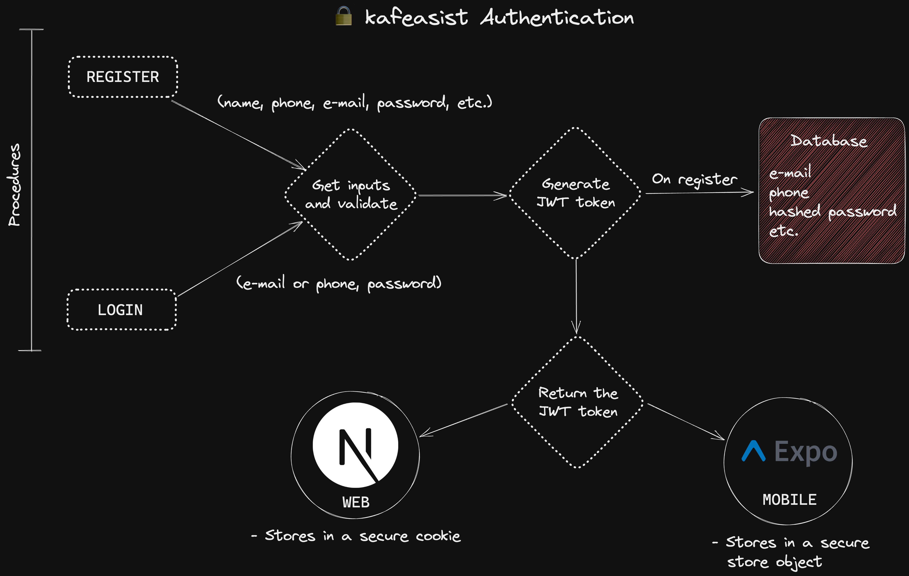

# @kafeasist:auth

This is the authentication package of kafeasist. It is used to manage the authentication of the users of the website and the mobile application of kafeasist.

## Table of contents

- [About `kafeasist:auth`](#about-kafeasistauth)
  - [Architecture](#architecture)
  - [JWT](#jwt)
  - [argon2](#argon2)
- [Parameters](#parameters)
  - [Login](#login)
  - [Register](#register)
- [Response object](#response-object)
  - [success](#success)
  - [token](#token)
  - [user](#user)
  - [message](#message)
  - [fields](#fields)

## About `kafeasist:auth`

### Architecture

Following image shows the architecture of the authentication package:

<p align="center">
	
</p>

### JWT

[JWT](https://jwt.io/) is a standard for creating access tokens for authentication. [JWT](https://jwt.io/) is a JSON object that contains a header, a payload and a signature. The signature is used to verify the token. [JWT](https://jwt.io/) is signed with a secret key. The secret key is stored in the environment variables.

The reason why [JWT](https://jwt.io/) is used is because both the website and the mobile application of kafeasist are using the same authentication package, therefore [JWT](https://jwt.io/) connects the two applications.

### argon2

The authentication package uses [argon2](https://www.npmjs.com/package/argon2) to hash the passwords of the users. Reason why [argon2](https://www.npmjs.com/package/argon2) is used is because it is a modern hashing algorithm that is designed to be resistant to GPU cracking attacks and it is also memory-hard, which makes it resistant to ASIC-based attacks.

## Parameters

Both procedures `login` and `register` require parameters. Here is the list of the parameters required for each procedure:

### Login

| Parameter      | Description                         | Type     |
| -------------- | ----------------------------------- | -------- |
| `emailOrPhone` | E-mail address or phone of the user | `string` |
| `password`     | Password of the user                | `string` |

### Register

The parameters for the `register` procedure are validated using custom made validators. Here is the list of the parameters required for the `register` procedure:

| Parameter         | Description                  | Type                                 |
| ----------------- | ---------------------------- | ------------------------------------ |
| `firstName`       | First name of the user       | `2 <= string <= 20`                  |
| `lastName`        | Last name of the user        | `2 <= string <= 20`                  |
| `phone`           | Phone number of the user     | `("5" + /^\d+$/)=10`                 |
| `email`           | E-mail address of the user   | `/^[\w-\.]+@([\w-]+\.)+[\w-]{2,4}$/` |
| `password`        | Password of the user         | `8 <= string <= 24`                  |
| `confirmPassword` | Confirmation of the password | `typeof password`                    |

If these parameters are not provided in the correct type, the procedure will throw an error.

## Response object

A response standard is used to make the response of the procedures consistent. `AuthResponse` was declared in the `types/` folder:

```typescript
type AuthResponse =
  | {
      success: true;
      token: string;
      user: User;
    }
  | {
      success: false;
      message: string;
      fields: string | string[];
    };
```

### success

`success` is a boolean that indicates whether the procedure was successful or not. If `success` is `true`, the procedure was successful. If `success` is `false`, the procedure was not successful.

- If the `success` was provided as `true`, then the `token` and the `user` should be provided.

- If the `success` was provided as `false`, then the `message` and the `fields` should be provided.

### token

`token` is a string that contains the [JWT](https://jwt.io/) token. The token is used to authenticate the user.

- The token is provided only if the `success` is `true`.

### user

`user` is an object that contains the information of the user.

- _**IMPORTANT**: Some fields of the `user` object are not provided in the response due to security reasons._

  ```typescript
  type User = {
    id: number;
    firstName: string;
    lastName: string;
    phone: string;
    email: string;
    isVerified: boolean;
  };
  ```

- The `user` object is provided only if the `success` is `true`.

### message

`message` is a string that contains the error message.

- The error message is provided only if the `success` is `false`.

### fields

`fields` is a string or an array of strings that contains the fields that caused the error.

- The fields are provided only if the `success` is `false`.

[⬆ Back to top](#table-of-contents)
