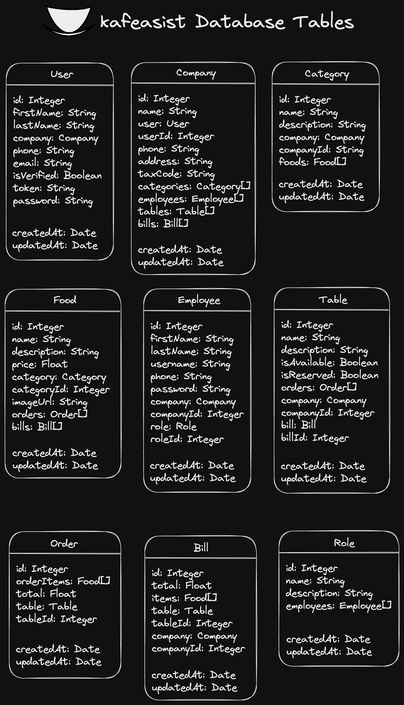
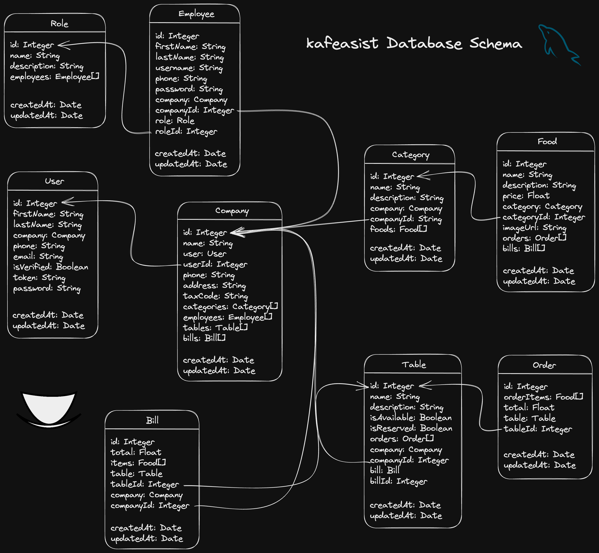

# @kafeasist:db

This is the database package of kafeasist. Package is designed to manage a [MySQL](https://www.mysql.com/) database with [Prisma](https://www.prisma.io/) as an ORM powered with [PlanetScale](https://planetscale.com/).

## Table of contents

- [About `kafeasist:db`](#about-kafeasistdb)
  - [Tables](#tables)
  - [Schema](#schema)
- [Why MySQL?](#why-mysql)
  - [PlanetScale](#planetscale)
- [Prisma](#prisma)
  - [Prisma Studio](#prisma-studio)
  - [Generate](#generate)
  - [Push](#push)

## About `kafeasist:db`

### Tables

Tables are defined in `schema.prisma` file. You can find the schema of the database in the [Schema](#schema) section. Theses tables are used to store data of the main website and the mobile application of kafeasist. The tables are:

<p align="center">
	
</p>

### Schema

You can find the schema of the database in the following image:

<p align="center">
	
</p>

## Why MySQL?

[MySQL](https://www.mysql.com/) was chosen as the database because it is a simple relational database. It provides what most of the relational databases provide and nothing more. Part of the reason why [MySQL](https://www.mysql.com/) was chosen is [PlanetScale](https://planetscale.com/).

### PlanetScale

[PlanetScale](https://planetscale.com/) is a database-as-a-service that provides a MySQL database with a lot of features. It is a great tool for developers and it is free for small projects.

## Prisma

[Prisma](https://www.prisma.io/) is an ORM that is used to manage the database. It is used to generate the database schema and to manage the database. [Prisma](https://www.prisma.io/) provides a lot of features for the developer and it is easy to use. It is also used to generate the TypeScript types for the database. With [Prisma Studio](https://www.prisma.io/studio), you can see the database in a GUI.

### Prisma Studio

[Prisma Studio](https://www.prisma.io/studio) is a GUI for the database. It is also used to manage the database. You can find more information about [Prisma Studio](https://www.prisma.io/studio) in the [Prisma documentation](https://www.prisma.io/docs/concepts/components/prisma-studio). To start [Prisma Studio](https://www.prisma.io/studio), run the following command:

```bash
pnpm dev
```

This command runs the [Prisma Studio](https://www.prisma.io/studio) at port `5556`.

### Generate

To generate the database schema, run the following command:

```bash
pnpm db:generate
```

This command generates the database schema in the `prisma` folder.

### Push

To push the database schema to the database, run the following command:

```bash
pnpm db:push
```

[⬆ Back to top](#table-of-contents)
